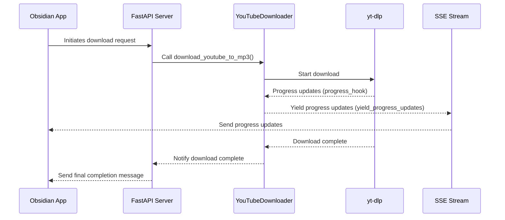

The YouTubeDownloader class is designed to download YouTube videos using the synchronous yt-dlp library, which is primarily a command-line utility with a Python wrapper that includes a callback for progress updates. Despite the synchronous nature of yt-dlp, the class uses asynchronous Python code to provide ongoing status updates to the Obsidian app through the Server-Sent Events (SSE) stream by utilizing the progress update callback of yt-dlp.

Key Components:
Inputs: YouTube URL, logger object.
Outputs: Progress updates, MP3 file, final completion message.
Design and Flow:
Initialization:
The class is initialized with the YouTube URL, a logger object, and an event loop.
Async Generator:
Uses an async generator (yield_progress_updates) to yield progress updates.
This design feeds status updates to a Server-Sent Events (SSE) stream, allowing the Obsidian application to receive feedback on download and transcription progress.
Main Method:
The main method, download_youtube_to_mp3, runs the synchronous download_yt_to_mp3 method in an executor to avoid blocking the main event loop.
The executor allows running blocking I/O-bound tasks like the YouTube download in a separate thread, ensuring the main event loop remains responsive.
Concurrently, it yields progress updates via the yield_progress_updates async generator.
Progress Updates:
Progress updates are communicated through a callback function, progress_hook.
The progress_hook uses asyncio.run_coroutine_threadsafe to place updates into an asyncio queue.
The callback functionality of yt-dlp informed this design decision.
Async Generator Iteration:
The async generator iterates over the asyncio queue, yielding progress updates to the caller until the download is complete.
Implementation Pattern:
Uses the asynchronous programming pattern, combining async/await and threading.
This pattern handles long-running synchronous tasks without blocking the main application, ensuring responsiveness and non-blocking behavior.
This structure ensures that the Obsidian application, which initiated the request, gets continuous feedback on the download and transcription progress, and ultimately receives the MP3 file.